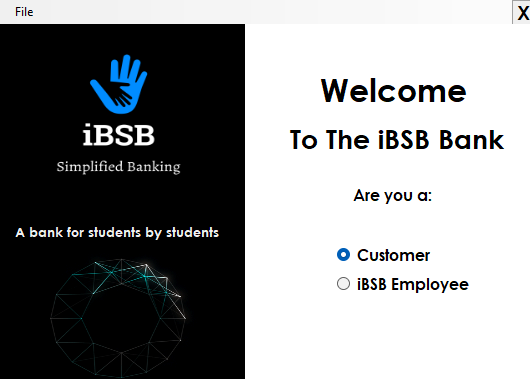
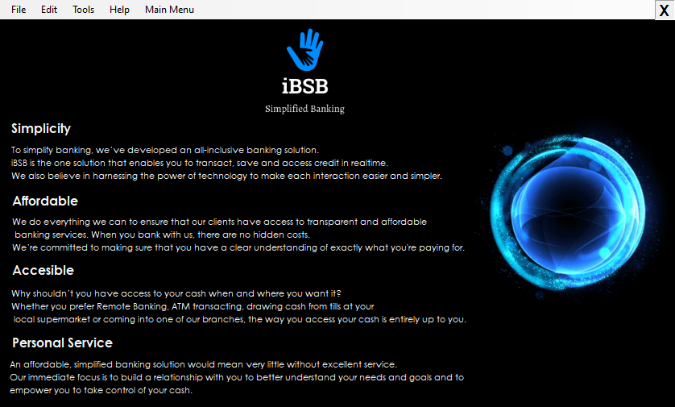

# Project Banking
This the 2nd program I wrote on the Commercial Programming course. The goal was to create a Windows Forms banking application using C#.

# Overview
Below  is the User Interface

# Tools Used
- C#
- Windows Forms (WPF)
- Visual Studio

# Features
- Loading Animations ⌚
- UI 💫
- Validation 🔓

